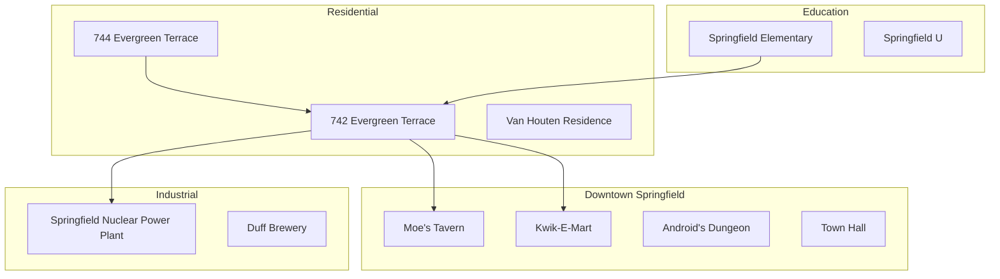
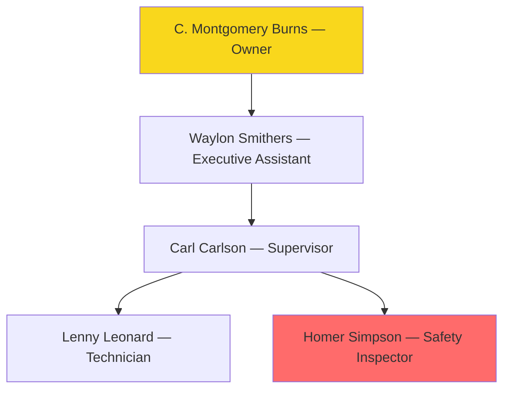

# The Complete Guide to Springfield

## Overview

Welcome to Springfield — a town of **32,000 residents**, one nuclear power plant, one monorail (decommissioned), and more donut shops per capita than anywhere else in the country.

> *"To alcohol! The cause of — and solution to — all of life's problems."* — Homer J. Simpson

## Town Map



---

## The Simpson Family

### Homer Jay Simpson

**Occupation:** Safety Inspector, Sector 7-G, Springfield Nuclear Power Plant

Homer has held **188 different jobs** over the years, including:

- Astronaut
- Food critic
- Monorail conductor
- Snow plow driver
- Grease salesman
- Mr. Plow
- Missionary

**Performance review (by Mr. Burns):**

| Category          | Score   | Notes                                    |
| ----------------- | ------- | ---------------------------------------- |
| Attendance        | 2/10    | Frequently sleeping at console           |
| Safety compliance | 1/10    | Caused 3 meltdowns this quarter          |
| Teamwork          | 6/10    | Gets along with everyone except Lenny    |
| Initiative        | 0/10    | "He doesn't even try" — direct quote     |
| Snack consumption | 10/10   | Exceeds all benchmarks                   |

### Marge Simpson (née Bouvier)

**Occupation:** Homemaker, occasional police officer, pretzel entrepreneur

Marge is the emotional backbone of the family. Her hair adds approximately **2 feet** to her height and has been used to:

1. Hide valuables
2. Store tools
3. Conceal a gambling addiction
4. Win a bodybuilding competition

### Bart Simpson

**Age:** 10 (permanently)

**Known aliases:**
- El Barto
- Bartman
- I Didn't Do It Boy

**Prank record:**

| Prank                               | Target          | Consequence                |
| ----------------------------------- | --------------- | -------------------------- |
| Called Moe's asking for "Al Coholic" | Moe Szyslak    | Death threats              |
| Released greased pigs in school      | Principal Skinner | 1 week detention          |
| Mooned the Australian embassy       | Australia       | International incident     |
| Sawed head off Jebediah statue      | Springfield     | Community service          |

### Lisa Simpson

**IQ:** 159

Lisa is a **jazz enthusiast**, vegetarian, Buddhist, and the most likely Simpson to win a Nobel Prize. Her saxophone solos have been described as "haunting" and also "please stop, it's 2 AM."

**Academic achievements:**
- Straight A student
- Spelling bee champion (3 consecutive years)
- Science fair winner
- Published author (*The Floreda Keys*, a crossword puzzle)

### Maggie Simpson

**Age:** 1 (permanently)

Doesn't say much but has:
- Shot Mr. Burns
- Led a daycare revolution
- Beaten up Baby Gerald repeatedly

---

## Springfield Nuclear Power Plant

### Organization



### Safety Record

| Year | Meltdowns | Near-Misses | Donuts Consumed | Inspector on Duty |
| ---- | --------- | ----------- | --------------- | ----------------- |
| 2020 | 2         | 47          | 3,650           | Homer Simpson     |
| 2021 | 1         | 52          | 4,100           | Homer Simpson     |
| 2022 | 3         | 38          | 3,900           | Homer Simpson     |
| 2023 | 0         | 61          | 4,500           | Homer Simpson     |

> **Mr. Burns:** *"I don't understand — we had zero meltdowns in 2023 but the most near-misses. What changed?"*
>
> **Smithers:** *"We stopped counting partial meltdowns as meltdowns, sir."*

### Emergency Procedures

```
EMERGENCY PROTOCOL 7-G (SECTOR 7-G MELTDOWN)

1. Don't panic
2. Put down the donut
3. Press the red button (NOT the blue one)
4. If you pressed the blue one, see step 1
5. Evacuate via the emergency exit
6. Call Mr. Burns (he won't answer)
7. Call Smithers
8. Pray
```

---

## Springfield Elementary

### Staff

| Name              | Role                | Tenure    | Fun Fact                              |
| ----------------- | ------------------- | --------- | ------------------------------------- |
| Seymour Skinner   | Principal           | 20+ years | Actually Armin Tamzarian              |
| Edna Krabappel    | 4th Grade Teacher   | 15 years  | "Ha!" is not pedagogical feedback     |
| Groundskeeper Willie | Groundskeeper    | 18 years  | Wrestling champion of Glasgow         |
| Lunchlady Doris   | Cafeteria Manager   | 22 years  | "More testicles means more iron"      |
| Otto Mann         | Bus Driver          | 12 years  | License revoked twice                 |

### Lunch Menu (Monday)

```
SPRINGFIELD ELEMENTARY CAFETERIA

Monday Special: Mystery Meat Surprise
- Main: Unidentified protein patty
- Side: Tater tots (or small rocks, unclear)
- Vegetable: Green substance
- Dessert: Pudding (color varies)
- Drink: Malk (now with Vitamin R)

Price: $1.50
Antacids: Included
```

### Student Organizations

- **Band** — Lisa Simpson, first chair saxophone
- **Newspaper** — *The Fourth Grader*, editor: Lisa Simpson
- **Debate Team** — 0-47 record
- **Chess Club** — Meets Tuesdays (if enough people show up)

---

## Local Businesses

### Moe's Tavern

**Hours:** 10 AM – 2 AM (or whenever Moe gets tired)

**Menu highlights:**

| Item               | Price | Description                             |
| ------------------ | ----- | --------------------------------------- |
| Duff Beer          | $3.00 | America's favorite beer                 |
| Duff Light         | $3.00 | Same as Duff, different label           |
| Duff Dry           | $3.00 | Also the same                           |
| Flaming Moe        | $6.00 | Cough syrup + fire (patent pending)     |
| Peanuts            | Free  | Been there since 1987                   |

### Kwik-E-Mart

**Proprietor:** Apu Nahasapeemapetilon (PhD, Computer Science)

**Store policies:**
1. No shirt, no shoes, no service (loosely enforced)
2. All sales final (especially the hot dogs)
3. Squishee refills: 50 cents
4. Shoplifting will be reported (eventually)

**Best sellers:**

1. Buzz Cola
2. Squishee (all flavors)
3. Krusty-O's cereal
4. Scratchy & Itchy comics
5. Questionable dairy products

---

## Annual Events

### Springfield Calendar


### Treehouse of Horror — Best Segments

| Segment                  | Season | Parody           | Scariness |
| ------------------------ | ------ | ---------------- | --------- |
| The Shinning             | 6      | The Shining      | **8/10**  |
| Time and Punishment      | 6      | Ray Bradbury     | **7/10**  |
| Nightmare on Elm Street  | 4      | Freddy Krueger   | **6/10**  |
| Homer³                   | 7      | Tron / 3D        | **9/10**  |
| Citizen Kang             | 8      | Election satire  | **5/10**  |

---

## Frequently Asked Questions

**Q: Why does no one in Springfield age?**
A: Time works differently in Springfield. Scientists believe it has something to do with the nuclear plant's radiation.

**Q: How many fingers do the characters have?**
A: Four on each hand. This is normal in Springfield.

**Q: Is Springfield in Oregon, Kentucky, or Illinois?**
A: Yes.

**Q: Why does Homer still have his job?**
A: Mr. Burns can never remember his name, which makes it impossible to fire him.

---

## Famous Quotes

> *"Eat my shorts!"* — Bart Simpson

> *"Don't have a cow, man."* — Bart Simpson

> *"Excellent."* — Mr. Burns

> *"Hi, I'm Troy McClure. You might remember me from such films as..."* — Troy McClure

> *"Everything's coming up Milhouse!"* — Milhouse Van Houten

---

## Appendix: Springfield by the Numbers

| Statistic                     | Value          |
| ----------------------------- | -------------- |
| Population                    | ~32,000        |
| Donut shops                   | 14             |
| Nuclear incidents (annual)    | 2-3            |
| Moe's prank calls (annual)   | ~200           |
| Bart's detentions (annual)    | 47             |
| Lisa's awards (lifetime)      | 63             |
| Homer's jobs (lifetime)       | 188            |
| Couch gags (total)            | 600+           |

---

*"The Simpsons" is a trademark of 20th Television. This document is purely fictional and created for testing purposes.*
